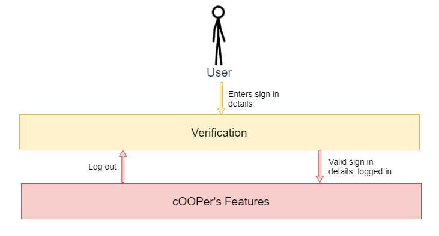
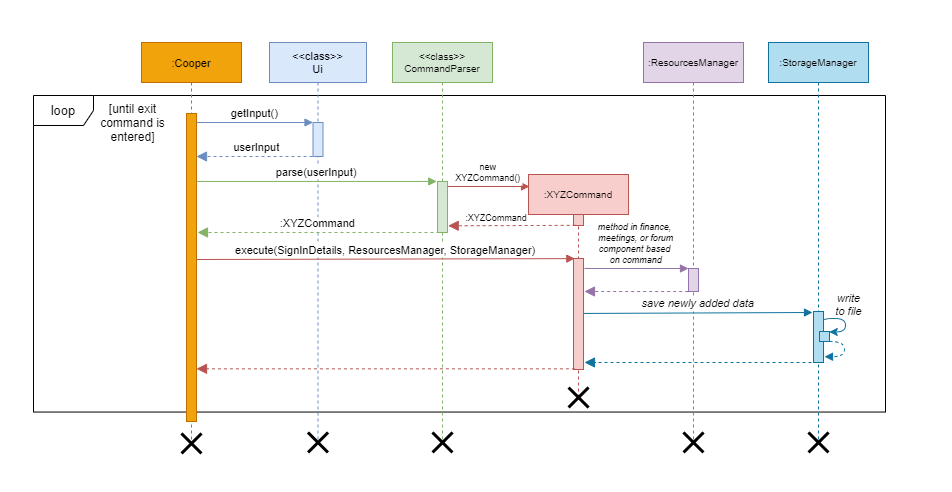
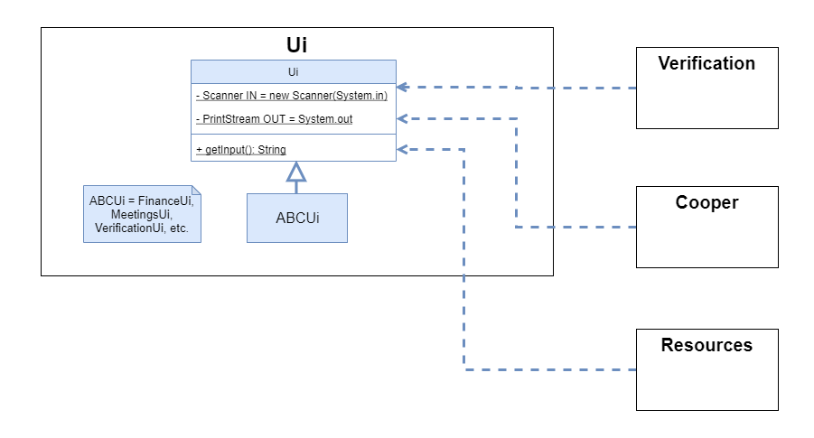
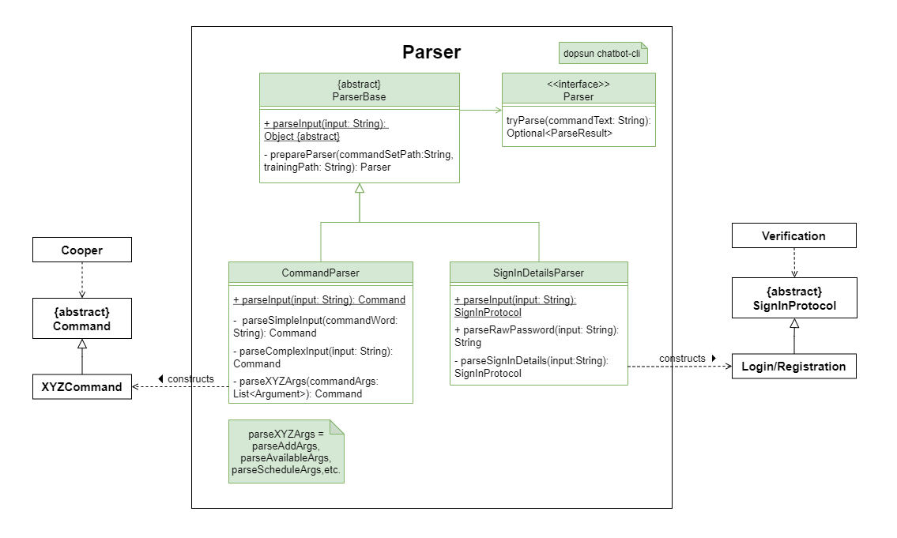

# Developer Guide

## Introducing cOOPer
cOOPer is a **Command Line Interface (CLI) desktop** application developed as a virtual assistant to simplify administrative processes of **tech startups** such as **communication** and **finance management**.

This developer guide is for software designers, developers, and software testers of cOOPer. It will be your reference manual if you are looking to:
- Know more about cOOPer's internal software design
- Improve cOOPer's internal software design
- Add more features to cOOPer
- Enhance cOOPer's existing features
- Perform software testing on cOOPer

## What's in this Developer Guide
- [Acknowledgements](#acknowledgements)
- [Setting Up and Getting Started](#setting-up-and-getting-started)
  - [Setting up cOOPer on your computer](#setting-up-cooper-on-your-computer)
  - [Before you code](#before-you-code)
- [Design](#design)
- [Implementation](#Implementation)

## Acknowledgements
1. [dopsun chatbot-cli](https://github.com/dopsun/chatbot-cli)
2. [theeugenechong's implementation of `Storage` for CS2113T's Individual Project (iP)](https://github.com/theeugenechong/ip/tree/master/src/main/java/duke/storage)
3. 

## Setting Up and Getting Started

> #### 💡 Tip:
> Here are the software/tools used in developing cOOPer. You are recommended to use them :
> - **IDE**: IntelliJ IDEA (highly recommended)
> - **JDK**: Java 11 
> - **Version control**: Git 
> - **Git GUI**: Sourcetree
> - **Build system**: Gradle

### Setting up cOOPer on your computer
1. Fork [this repo](https://github.com/AY2122S1-CS2113T-W13-4/tp) and clone the fork into your computer.
2. If you are using IntelliJ IDEA, ensure that IntelliJ is configured to use **JDK 11**. You can refer to IntelliJ's
own documentation [here](https://www.jetbrains.com/help/idea/sdk.html#set-up-jdk) to correctly configure the JDK.
3. Import the project as a Gradle project. You can follow [this guide](https://se-education.org/guides/tutorials/intellijImportGradleProject.html) to find out how to import the project into IntelliJ.
4. Verify the setup:
   1. Running `cooper.Cooper`
      1. Navigate to `src/main/java/cooper/Cooper.java`
      2. Right click on `Cooper.java` and select "Run Cooper.main()".
      3. You should see the following output if the setup was done correctly:
      
```
            /$$$$$$   /$$$$$$  /$$$$$$$
           /$$__  $$ /$$__  $$| $$__  $$
  /$$$$$$$| $$  \ $$| $$  \ $$| $$  \ $$ /$$$$$$   /$$$$$$
 /$$_____/| $$  | $$| $$  | $$| $$$$$$$//$$__  $$ /$$__  $$
| $$      | $$  | $$| $$  | $$| $$____/| $$$$$$$$| $$  \__/
| $$      | $$  | $$| $$  | $$| $$     | $$_____/| $$
|  $$$$$$$|  $$$$$$/|  $$$$$$/| $$     |  $$$$$$$| $$
 \_______/ \______/  \______/ |__/      \_______/|__/
=========================================================================
Hello I'm cOOPer! Nice to meet you!
=========================================================================
Login or register to gain access to my features!
To login, enter "login  [yourUsername] pw [password] as [yourRole]"
To register, enter "register [yourUsername] pw [password] as [yourRole]"
=========================================================================
>> 
```

   2. Running `JUnit` tests (optional):
      1. Navigate to `src/test`.
      2. Right click on `test` and select "Run all tests".
      3. All the tests should pass and you should see the following:
      

### Before you code
- **Configure coding style**
  - If you are using IntelliJ IDEA, follow [this guide](https://se-education.org/guides/tutorials/intellijCodeStyle.html)
  to set up IntelliJ to match our coding style.
- **Set up CI**
  - GitHub automatically detects the GitHub actions config file located in the `.github/workflows` folder. CI for cOOPer is automatically run at each push to the `master` branch or whenever a pull request is created.
- **Get to know cOOPer's design**
  - One last thing to know before you start coding is cOOPer's overall software design. You are recommended to get some sense of cOOPer's overall design in the [Design](#design) section below.

## Design

> #### 💡 Tip:
> The diagrams in this document were created using **draw.io**. The `.png` templates used to create the diagrams
> can be found in the [`developerGuideDiagrams`](developerGuideDiagrams) folder. To create and edit diagrams, access the draw.io [website](https://app.diagrams.net/),
> select 'Open Existing Diagram' and open the desired `.png` file.

### Overview

cOOPer consists of two main layers: **verification** layer and **features** layer as shown in the diagram below.
cOOPer recognizes different sets of inputs at each layer.



Upon launching the app, the user starts at the **verification**
layer where they can only [log in](UserGuide.md#login) or [register](UserGuide.md#user-registration). Entering valid
sign in details will then grant the user access to the **features** layer where they can input commands like `cf` and
`available` to use cOOPer's features. At this layer, entering the `logout` command will bring the user back to the
verification layer.

### Architecture


The **Architecture Diagram** above shows the high-level design of cOOPer and how cOOPer's components are connected.

`Cooper` contains the *main* method of the program. `Cooper`'s responsibilities are as such:
- Upon **launching the app**, `Cooper` initializes the components and loads stored user data into the components. 
- While the **app is running**, `Cooper` reads user input which is then processed by the components to produce 
a result.
- Upon **shutting down the app**, `Cooper` saves any unsaved user data to the hard disk and shuts down the components. 

Apart from `Cooper`, the rest of the app consists of these seven components:
- [`Ui`](#ui-component): Handles the reading of user input and printing of messages to the terminal.
- [`Parser`](#parser-component): Interprets and validates user input.
- [`Verification`](#verification-component): Verifies that the user is signing in to the system with the correct credentials.
- [`Command`](#command-component): Executes commands which are parsed from user input.
- [`Resources`](#resources-component): Manages cOOPer's data for finance, meetings and forum features while the app is running.
- [`Storage`](#storage-component): Loads data from, and saves data to storage files in the computer hard disk.
- [`Util`](#util-component): Unrelated utility methods which help with some of cOOPer's features.

#### Interaction of the architecture components to process user input
- The *sequence diagram* below shows how cOOPer's components interact with each other when a user enters their **sign in 
details** for verification.

> #### 📝 Note:
> `userInput` represents the sign in details input by the user for verification. For example, `register 
> John pw 12345 as admin`.


- The next sequence diagram below shows how cOOPer's components interact with each other when a user enters a **command** after
successfully logging in.

> #### 📝 Note:
> - `userInput` represents a command input by the user. For example, `meetings`.
> - `XYZCommand` is an object representing a command recognised by cOOPer. For example, `AddCommand`.



### Ui Component

**API**: [`Ui.java`](../src/main/java/cooper/ui)



- The `Ui` component consists of a parent `Ui` class and its subclasses as shown by the class diagram above.
- The parent `Ui` class contains general constants and methods used across cOOPer's components which read user input and 
print recurring messages.
- On the other hand, the subclasses for the different components in cOOPer (`ABCUi`) contain constants and methods specific to
the function of that component. For example, `FinanceUi` contains a method `printBalanceSheet()` which prints a balance sheet
formatted with headers containing the entries input by the user.
- The classes in Ui have *static* methods so there is no need to create a `Ui` object in `Cooper`.

The `Ui` component:
- Reads in user input from the terminal
- Prints status messages, error messages and messages prompting the user for input
- Is used by `Verification` and `Cooper` mainly for reading input, while it is used by `Resources` mainly for printing output messages

### Parser Component

**API**: [`ParserBase.java`](../src/main/java/cooper/parser)



- The `Parser` component consists of an abstract `ParserBase` class with its children classes, `CommandParser` and `SignInDetailsParser`. 
To emphasize the different [layers](#overview) of cOOPer and to improve *cohesiveness*, different objects are parsed from user input at each layer.
- User input at the verification layer will be parsed to construct a `SignInProtocol` object while user input at the features layer 
will be parsed to construct a `Command` object. The `SignInProtocol` object executes the signing in of the user using the details provided in the user input 
while the `Command` object executes the command input by the user.
- `ParserBase` contains a reference to the `Parser` *interface* from the [dopsun chatbot-cli](https://github.com/dopsun/chatbot-cli) library
used by cOOPer. More information about cOOPer's implementation of the library can be found [here](#parsing-user-input).

The `Parser`component:
- Constructs and returns a new `SignInProtocol`/`Command` object with the correct parsed attributes
- Determines if user input corresponds to any of the commands recognised by cOOPer
- Validates user input by checking for erroneous command arguments. For example, empty command arguments or entering alphabets where an integer 
is expected
- Does not perform any printing of error messages, but instead throws `InvalidCommandFormatException`, `UnrecognisedCommandException` etc.
to signal erroneous input 

### Verification Component


### Command Component

### Resources Component

### Storage Component

### Util Component

**API**: [`Util.java`](../src/main/java/cooper/util/Util.java)

- The `Util` component is a component unrelated to cOOPer and serves mainly as a helper component to make some of cOOPer's
features possible.
- There are only two methods in the `Util` class, namely `inputStreamToTmpFile()` and `inputStreamToString()`. 
- `inputStreamToTmpFile()` is used to recreate the dopsun chatbot-cli's training files (originally located in `src/main/resources`). In the
process of packaging cOOPer into a JAR application, these training files are converted to bytes which are unable to be read in by the chatbot API. Hence,
there is a need to recreate these files for the chatbot to work.
- `inputStreamToString()` is used for cOOPer's `generate` feature which allows the user to generate a PDF file from data in cOOPer's Balance Sheet or
Cash Flow Statement. This method is used to convert the `.tex` template files into a `String` object which can then be handled easily 
in the code. More details of implementation can be found [here]().

## Implementation

### Parsing user input

`Parser` interprets and validates user input and then constructs `SignInProtocol` and `Command` objects which .

#### Dopsun chatbot-cli

cOOPer's uses the [dopsun chatbot-cli](https://github.com/dopsun/chatbot-cli) library as its frontend parser that allows you to define any arbitrary *input schema* under `src/main/resources/parser/command-data.properties` 
such as 

```
login = login ${username-hint} pw ${password-hint} as ${role-hint}
```

The `Parser` library automatically parses the place-holders defined with `$` leaders to strings. For example, `login Yvonne pw 12345 as admin` will be parsed 
into the following fields:

```python
{ "username-hint" : Yvonne,
  "password-hint" : 12345,
  "role-hint" : admin }
```

This gives great flexibility and extensibility to the `Parser` component as you do not need to worry about writing new parsing schemes for every command 
and adding new commands to cOOPer for new features become trivial.

### Command

`Command` are action objects that implement the `execute()` methods for interacting with different resources such as the `FianceManager`and `MeetingsManager`.

#### Command component descriptions

As mentioned above, `CommandParser` returns a `Command` polymorphic base object. Any specialisation of the `Command` base object must implement the`execute()` abstract base method. For example, Developer can add a new command like `HelloCommand` by inheriting from the `Command` base class and implements the `execute()` function to print out `Hello world` as shown below.

```java
public class HelloCommand extends Command {
	// constructors and arguments to execute function are omitted
	public void execute() {
		System.out.println("Hello world");
	}
}
```

This allows developers to inherit any arbitrary number of different command specialisation with different 
behaviours using a unified driver. Developers do not need to modify the frontend to accommodate for every new commands.

### Meetings
`Meetings` provides features like **declaring** availability, **viewing** availability, **scheduling** meetings, and **viewing** user-specific scheduled meetings.

#### Meeting module descriptions
`MeetingManger` stores **2** attributes:
1. the **timings** along with the **usernames** of the available users, which is a `TreeMap<LocalTime, ArrayList<String>>` object,
2. the **list of meetings** scheduled, which is an `ArrayList<Meeting>` object.

The `ArrayList<Meeting>` object stores 0 or more `Meeting` objects

Meeting object stores 3 attributes:
1. the `meetingName`, which is a `String` object,
2. the `time`, which is a `LocalTime` object,
3. the `listOfAttendees`, which is an `ArrayList<String>` object

When the user wants to enter an availability, `MeetingManager` will check if the time entered is in the **correct format** and if the user has **not already entered their availability to that time**. Addition of availability is successful only if those two requirements are satisfied.

When the user wants to schedule a meeting, `ScheduleCommand` will check if the user has entered a **valid time value**. If so, it will call the `MeetingManager` to run an **auto scheduling** function. If not, it will call the `MeetingManager` to run a **manual scheduling** function.

### Forum 

`Forum` provides features like posting a forum thread, commenting on a post, listing posts. 

#### Forum module descriptions

`ForumManager` stores a list of `ForumPost`objects. Each `ForumPost` object stores a list of `ForumComment` objects. Both `ForumPost` and `ForumComment` need to store two attributes, username and content. When a user wants to delete a post or comment, `ForumManager` will check if the username of the post matches the user performing the action and deletion is successful only if these two are a match.

### Resources

`Resources` manages other manager modules like the `FinanceManager`, `MeetingsManager` and `ForumManager`.

#### Resources module descriptions

`ResourcesManager` grants reference to other manager modules for different `Command` objects to perform their execution functions  by checking the `UserRole`. For example, 

```java 
FinanceManager financeManager = resourcesManager.getFinanceManager(userRole);
```

will return a `FinanceManager` object only if `userRole` is an `admin`. Otherwise, `null` will be returned indicating the user does not have the access right to that module.

## Product scope

### Target user profile

The target user profile of cOOPer consists of all levels of administration in a tech startup. Namely - from the employee level of Secretary up to the management level of CEO.

**Example Users:**
* has a need to schedule company meetings in timely manner
* has a need to generate and store financial statements
* has a need to raise timely concerns to management
* has a need to perform reliable company growth projections
* comfortable with typing interactions on a CLI

### Value proposition

**cOOper's value proposition:** Manage company financials _faster_ than typical human accounting means
& manage company communication _more reliably_ than a typical GUI driven app.

## User Stories
Priorities: High (must have) - `* * *`, Medium (nice to have) - `* *`, Low (unlikely to have) - `*`

| Priority | As a ... | I want to ...             | So that I can ...                                           |
| ------- | -------- | ------------------------- | ----------------------------------------------------------- |
| `***`    | new user | see usage 'help' instructions    | refer to them when I forget how to use the application      |
| `***`    | new user     | register an account | login and return to my saved work at any point later on |
| `***`    | user     | see a list of roles at login | login to the specific role I need to carry out a task |
| `***`    | user     | have a password encrypted login | have my saved work be protected from any external tampering |
| `***`    | finance admin     | automatically generate the company's financial statements | assess the company's current financial health accurately and quickly |
| `***`    | secretary employee     | see all company personnel's weekly availability | schedule meetings between all available members easily |
| `**`    | finance admin     | automatically generate projections on the company's yearly profitability | assess the company's potential future growth|
| `**`    | employee     | make posts on a company forum | discuss difficulties or interesting developments in the company |
| `**`    | secretary employee     | automatically schedule a meeting without having to know other person's availability| save time on finding an appropriate time to meet  |
| `*`    | user in a hurry     | customise shortcut keys in the app| save time on retrieving the data I desire  |

## Non-Functional Requirements

* Should work on any _mainstream OS_ with Java 11 installed.
* Should be able to store up to 1000 meetings, forum posts, and financial statements without observing any noticeable sluggishness in performance.
* Should login and enter user-specific roles faster than traditional web-applications
* A user with average typing speed should be able to accomplish meeting scheduling and forum posting faster and more reliably using commands than using a mouse interaction GUI driven app.
* A user with average typing speed should also be able to accomplish financial statement creation faster than by human means or a mouse interaction GUI driven app. 

## Glossary

* *mainstream OS* - Windows, OS-X, Linux, Unix

## Instructions for manual testing

{Give instructions on how to do a manual product testing e.g., how to load sample data to be used for testing} 
